---
tags:
  - 行动记录
---

# 银川出行行动记录

## 行程概览

- **日期**：7月4日
- **地点**：银川
- **到达时间**：早上 7:00
- **出发时间**：上午 9:00

## 行程时间线

| 时间段 | 项目 | 备注 |
|--------|------|------|
| 07:00 - 09:00 | 到达 & 收拾 | 抵达银川，洗漱整理，准备出发 |
| 10:00 - 11:00 | 射箭 | 开场项目，轻量互动 |
| 11:30 - 12:30 | 午饭 | 推荐当地特色 |
| 13:30 - 14:30 | 卡丁车 | 竞速体验 |
| 15:00 - 16:00 | 密室逃脱 | 团队协作 |
| 17:00 - 18:30 | 按摩 | 放松休整 |
| 19:00 - 20:30 | 晚饭 | 补充能量 |
| 21:00 - 23:00 | 剧本杀 | 收尾项目，沉浸式互动 |

## 行动甘特图

```mermaid
gantt
    title 银川出行行程甘特图
    dateFormat HH:mm
    axisFormat %H:%M

    section 上午
    到达 & 收拾       :done, 0700, 2h
    射箭              :active, 1000, 1h
    午饭              :1130, 1h

    section 下午
    卡丁车            :1330, 1h
    密室逃脱          :1500, 1h
    按摩              :1700, 1.5h

    section 晚上
    晚饭              :1900, 1.5h
    剧本杀            :2100, 2h
```

## 准备清单

- [ ] 防晒用品
- [ ] 运动服装（射箭、卡丁车）
- [ ] 替换衣物
- [ ] 充电宝
- [ ] 项目预约确认
